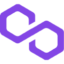

<div id="top"></div>
<!--
*** Thanks for checking out the Best-README-Template. If you have a suggestion
*** that would make this better, please fork the repo and create a pull request
*** or simply open an issue with the tag "enhancement".
*** Don't forget to give the project a star!
*** Thanks again! Now go create something AMAZING! :D
-->

<!-- PROJECT SHIELDS -->
<!--
*** I'm using markdown "reference style" links for readability.
*** Reference links are enclosed in brackets [ ] instead of parentheses ( ).
*** See the bottom of this document for the declaration of the reference variables
*** for contributors-url, forks-url, etc. This is an optional, concise syntax you may use.
*** https://www.markdownguide.org/basic-syntax/#reference-style-links
-->

<!-- PROJECT LOGO -->
<div align="center">
  <h3 align="center">Chainlink Price Feeds implementation</h3>
  
  <a href="https://chain.link/">
    
  </a>
  <a href="https://polygon.technology/">
    
  </a>

  <p align="center">
    <h4>Enable EVM smart contracts to get the ETH/USD price on Polygon</h4>
    <!--<br />
    Build this project from stratch: https://youtu.be/92rnG1t_55I
    <br />·-->
    <!--<a href="https://github.com/konytech/ethereum-ercs-demo">View Demo (WIP)</a>
    ·-->
    <a href="https://github.com/konytech/ethereum-ercs-demo/issues">Report Bug</a>
    ·
    <a href="https://github.com/konytech/ethereum-ercs-demo/issues">Request Feature</a>
    <br />
  </p>
</div>

<!-- TABLE OF CONTENTS -->
<ol>
  <li>
    <a href="#overview">Overview</a>
    <!-- <ul>
      <li><a href="#built-with">Built With</a></li>
    </ul>-->
  </li>
  <li><a href="#installation">Installation</a></li>
  <li><a href="#setting-environment-variables">Setting Environment Variables</a></li>
  <li><a href="#deployment">Deployment</a></li>
  <li><a href="#read-price-feed">Read Price Feed</a></li>
  <li><a href="#test">Test</a></li>
  <li><a href="#license">License</a></li>
</ol>

<!-- OVERVIEW -->
## Overview

### Built With

* [Hardhat](https://hardhat.org/)
* [Solidity](https://docs.soliditylang.org/)
* [ethers.js](https://docs.ethers.io/)
* [Node.js](https://nodejs.org/)

<!-- GETTING STARTED -->
## Installation

1. Clone the repo
   ```sh
   git clone https://github.com/konytech/chainlink-hardhat-pricefeed.git
   ```
3. Install NPM packages
   ```sh
   npm ci
   ```

## Setting Environment Variables

The following environment variables are expected: `MUMBAI_RPC_URL`, `MNEMONIC` \
The easiest way to set those variables is to create a `.env` file at the project root.

`.env` example:
```
MUMBAI_RPC_URL='https://polygon-mumbai.alchemyapi.io/v2/your-api-key'
MNEMONIC='your mnemonic'
```
⚠️Never commit the `.env` file. Your mnemonic and api keys should remain private!

## Deployment

Deploy <a href="hardhat/contracts/PriceConsumerV3.sol">the contract</a> that implements `getLatestPrice()`, allowing to get the latest price feed:
   ```sh
   npx hardhat deploy
   ```
See the <a href="hardhat/deploy/01_Deploy_PriceConsumerV3.js">deployment script</a> for deployment steps.

## Read Price Feed

To read the latest ETH/USD price feed from the deployed contract, run:
   ```sh
   npx hardhat read-price-feed --contract DEPLOYED_CONTRACT_ADDRESS_HERE
   ```
See the <a href="hardhat/tasks/read-price-feed.js">read-price-feed task</a> for more details.

## Test

A <a href="hardhat/test/unit/PriceConsumerV3_unit_test.js">unit test</a> is available. Test steps:
- Get the deployed contract address
- Call `getLatestPrice()` from the contract in the EVM
- Check the returned value from `getLatestPrice()` is greater than `0`

To run the test:
   ```sh
   npm run test
   ```
   
To force the deployment and run the test (avoiding reusing past contract deployments):
   ```sh
   npm run test-deploy
   ```

<!-- LICENSE -->
## License

Distributed under the **MIT License**.

<!-- MARKDOWN LINKS & IMAGES -->
<!-- https://www.markdownguide.org/basic-syntax/#reference-style-links -->
